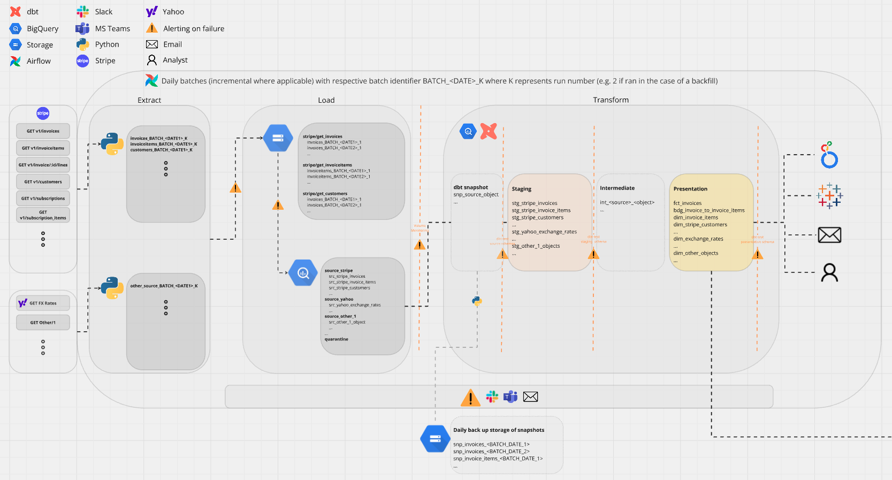
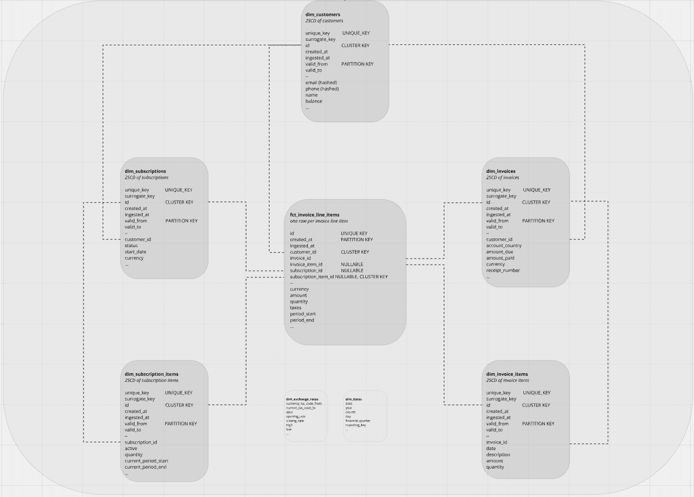

# Mob Data Engineer Task October 2025

## Introduction

This document includes a high level architecture design following medallion principles and utilising [dbt](https://www.getdbt.com/product/what-is-dbt) to ingest and model invoice data from Stripe.

The proposed final **schema design** is also documented. Please note that this is not materialised due to time constraints and limited availability of data.

The **code samples** provide templates for what the final mart model that would be materialised using `dbt` would look like. To explore the appropriate shape of the data, a mock invoice containing subscription items has been generated. This example includes a propration in addition to a placeholder for currency exchange rate application. For simplicity, the exchange rate at the time of invoice creation is used.

## Architecture Design



[Miro board](https://miro.com/app/board/uXjVJ0pS0_8=/)

Extraction Strategy Options:

1. Full extraction: Fetch **all** objects from source and mirror the current state-of-play in the source layer in the data warehouse (BigQuery)
    - Call the corresponding Stripe API endpoint (e.g., GET /v1/customers, GET /v1/invoices).
    - Replace all existing records in the raw staging table with the latest version.
    - Downstream models or [dbt snapshot](https://docs.getdbt.com/docs/build/snapshots) handle change detection, historical tracking, and slowly changing dimensions (SCD).
    - ✅ Simple extraction logic (no need for state tracking at extraction).
    - ✅ Works well for relatively static objects.
    - ⚠️ Overwrites previous state, so snapshots are **required** to detect changes and are a unique source of data.
    - ⚠️ Runs are irrespective of batch date (always reflective of execution date).
    - ⚠️ Inefficient for large or dynamic tables.

2. Incremental extraction: Fetch **only new or updated records** since the last Extraction run
    - Call the corresponding Stripe API endpoint (e.g., GET /v1/customers, GET /v1/invoices) with batch filtering on the request (for example `created.gte` in [GET](https://docs.stripe.com/api/invoices/list?lang=curl#list_invoices-created-gt) request)
    - This requires maintaining a watermark of the latest state of an object where the watermark is updated once successfully loaded.
    - ✅ Efficient — only new or changed records are extracted.
    - ✅ Efficient — only new or changed records are extracted.
    - ⚠️ More complex ETL logic (state management, backfills).
    - ⚠️ More appropriate in the case of timestamp availability (e.g. `updated_at`).

Given the volumes described in the task, in addition to the specified daily requirements and time-contraints, the *full extraction* strategy is proposed on a daily schedule. Note that the change-detection strategy will be consistent across all objects using a SHA-256 hash of the payload and utilising [dbt snapshot](https://docs.getdbt.com/docs/build/snapshots) using the [`check` strategy](https://docs.getdbt.com/docs/build/snapshots#check-strategy) using this hash of the payload (driven by the abscence of an `updated_at` field). This generates slowly-changing-dimensions-type-2 (SCD2) of all objects.

Extraction here is utilising the `GET v1/<OBJECT>` routes provided by the Stripe API documentation. The `etl/extract` directory gives an example of gathering this data using the Stripe Python library and loading this into a Google Cloud Storage bucket. This has not been tested. In the real-world, I would prefer each route to be a separate ingestion.

Prior to downstream layers being executed, volume testing (spike detection) would be run to warn of unexpected patterns in the volume of invoices/subscriptions being created. The use of the dbt testing suite would be applied to validate expected data values and completeness.

This data is then loaded into the **source** layer of the data warehouse, which [dbt snapshots](https://docs.getdbt.com/docs/build/snapshots) would then be applied to track of object changes.

This would then be modelled using staging, intermediate and presentation layers to follow a medallion architecture. The proposed schema is discussed below.

Orchestration would be managed by [Apache Airflow](https://airflow.apache.org/) and would utilise `on_failure_callback` funtionality which would send a message to a communication tool such as Slack or Teams.

## Schema Design

Proposal: a normalised, star schema, with `fct_invoice_line_items` at the center where all dimensions reflect Stripe objects and are slowly-changing-type-2 dimensions. This reduces data duplication avoiding redundancy across full extracts (clean, historical, per-entity versioning), simple auditing (trace back to Stripe source) and efficient incremental transformations. Here, joining utilising object state periods allow for consistent reporting in addition to a full audit trace and 

Following this a mart layer would be introduced to encapsulate business logic deriving daily recognised and deferred revenue which can then be used in a reporting suite. *Snippets* of what this mart layer would look like can be demonstrated using the Python transformations seen in `etl/transform`. 



**Consistent Keys Dimensions:**  
- `unique_key` → state key x valid from (**UNIQUE_KEY**)
- `ingested_at` → timestamp of warehouse ingestion
- `surrogate_key` → SCD2 state key
- `id` → Internal system ID (**CLUSTER KEY**)
- `valid_from` → SCD2 start date
- `valid_to` → SCD2 end date

---

## **dim_customers** – 2SCD of customers
**Example fields:**  
- `unique_key`, `surrogate_key`, `id`, `created_at`, `valid_from`, `valid_to`  
- `email`, `phone`, `name`, `balance`

---

## **dim_invoices** – 2SCD of invoices
**Example fields:**  
- `unique_key`, `surrogate_key`, `id`, `created_at`, `valid_from`, `valid_to`  
- `customer_id`, `amount_due`, `amount_paid`, `currency`, `receipt_number`

---

## **dim_invoice_items** – 2SCD of invoice items
**Example fields:**  
- `unique_key`, `surrogate_key`, `id`, `created_at`, `valid_from`, `valid_to`  
- `invoice_id`, `description`, `amount`, `quantity`

---

## **dim_subscriptions** – 2SCD of subscriptions
**Example fields:**  
- `unique_key`, `surrogate_key`, `id`, `created_at`, `valid_from`, `valid_to`  
- `customer_id`, `status`, `start_date`, `currency`

---

## **dim_subscription_items** – 2SCD of subscription items
**Example fields:**  
- `unique_key`, `surrogate_key`, `id`, `created_at`, `valid_from`, `valid_to`  
- `subscription_id`, `active`, `quantity`, `current_period_start`, `current_period_end`

---

## **fct_invoice_line_items** – Fact table
**Example fields:**  
- `id` (UNIQUE KEY), `created_at` (PARTITION KEY), `customer_id` (CLUSTER KEY)  
- `invoice_id`, `invoice_item_id` (nullable), `subscription_id` (nullable), `subscription_item_id` (nullable, CLUSTER KEY)  
- `currency`, `amount`, `quantity`, `taxes`, `period_start`, `period_end`

## Extensions

Additional such as daily exchange rates (`dim_exchange_rates`) sourced from a third party and `dim_dates` that describing fiscal properties of a date in addition to allowing for internal reporting categorisation.

## Code Sample

The focus of these code samples are to provide executable scripts to create a model that returns recognised and deferred revenue at a daily granularity given an example invoice object from the Stripe API.

Note that there also exists extraction (to GCS, as proposed in the architecture prior to ingestion into the warehouse) using Stripe's Python library. This has been created following the documentation and has not been validated.

The full script can be found in the `elt/transform` directory.

```python
def schedule_revenue(invoice_lines: List[Dict[str, Any]], invoice_date: datetime) -> List[Dict[str, Any]]:
    """
    Schedule revenue recognition for invoice lines, handling prorations and subscription changes.
    Returns both recognised and deferred revenue entries daily.
    """
    schedule = []
    current_date = get_current_date()
    
    for line in invoice_lines:
        # Convert timestamps to datetime
        start = datetime.fromtimestamp(line["period"]["start"])
        end = datetime.fromtimestamp(line["period"]["end"])
        length = (end - start).days
        
        if length <= 0:
            continue

        parent = line.get("parent", {})
        subscription_details = parent.get("subscription_item_details", {})
        
        # Calculate daily revenue
        daily_rev = line["amount"]/100 / length
            
        for i in range(length):
            day = start + timedelta(days=i)
            revenue_status = "recognised" if day.date() <= current_date else "deferred"
            date_str = day.strftime("%Y-%m-%d")
            gbp_rate = get_exchange_rate(date_str, "usd", "gbp")
            schedule.append({
                "invoice_line_id": line["id"],
                "date": date_str,
                "amount_usd": round(daily_rev, 2),
                "amount_gbp": round(daily_rev * gbp_rate, 2),
                "gbp_rate": gbp_rate,
                "revenue_status": revenue_status,
                "type": "subscription" if not line.get("proration", False) else "proration",
                "subscription_id": subscription_details.get("subscription", ""),
                "recorded_date": invoice_date.strftime("%Y-%m-%d"),
                "currency": "usd"
            })
            
    return schedule
```


## Discussion

*Tax Treatment: A customer in GERMANYy has an annual €43.74 subscription with 19% VAT (inclusive). The invoice shows total=43.74, tax=6.98, and we need to recognise €3.06 in revenue per month (excluding VAT). Walk through your calculation and any edge cases.*

*Missing Data: You discover that 3% of paid invoices are missing line_items.period.end dates (they're null). How do you handle this in production?*

*Historical Backfill: We need to backfill 2 years of historical data (say, ~100,000 invoices). What's your strategy for the initial load vs. ongoing daily syncs?*

*Future-proofing the Infrastructure: Discuss how your design would scale if data volume increases by orders of magnitude (10x, 100x).*

*Business Logic Clarification: The finance team says ‘we recognise revenue daily’ but the Stripe subscription periods are monthly/yearly. Do you recognise 1/30th of the monthly revenue each day, or the full month's revenue on the 1st? What questions would you ask?*

## Notes

* A **Subscription** (agreement) contains **Subscription Items** (products, prices)
* An **Invoice** contains **Invoice Line Items**, where each **Invoice Line Item** has a *parent* corresponding to either an **Invoice Item** or a **Subscription Item**
* *Deferred Revenue*: Revenue that is money a company receives in advance for goods or services it has not yet delivered. "Unrecognised revenue" - applicable example being an annual subscription with remaining periods not yet provided for.
* *Recognised Revenue*: Revenue that has been recorded in a company's financial statements once it is earned, which occurs when the company has transferred control of goods or services to a customer. Applicable example being closed-year proportion of annual subscription payment(?).
* Stripe's revenue recognition logic recognizes revenue when it is earned, not when it is paid, in accordance with accrual accounting principles
* Tax rates (inclusive or exclusive) are determined by a *customer* setting
* Multiple exchange rates used
* Subscriptions can change and are reflected in *proration line items*
* [Stripe Invoices API](https://docs.stripe.com/api/invoices)
    * the `lines` object on an invoice represent the individual line items that make up the invoice. lines is sorted as follows: (1) pending invoice items (including prorations) in reverse chronological order, (2) subscription items in reverse chronological order, and (3) invoice items added after invoice creation in chronological order.
* [Stripe Invoice Items API](https://docs.stripe.com/api/invoiceitems)
    * An Invoice Item is a standalone record that represents something you want to include on a future invoice, like a product charge, credit, or adjustment before the invoice is actually finalised. "Draft charge"
* [Stripe Invoice Line Items API](https://docs.stripe.com/api/invoice-line-item)
    * An Invoice Line Item represents a line within a specific invoice meaning it only exists in the context of an invoice. "Final charge".
* [Stripe Subscriptions API](https://docs.stripe.com/api/subscriptions)
* [Stripe Tax Documentation](https://docs.stripe.com/tax)
* [Stripe Revenue Recognition](https://docs.stripe.com/revenue-recognition/methodology?locale=en-GB#data-modeling)
* [How prorations work](https://docs.stripe.com/billing/subscriptions/prorations?locale=en-GB#how-prorations-work): For example, upgrading or downgrading a subscription can result in prorated charges. If a customer upgrades from a 10 USD monthly plan to a 20 USD option, they’re charged prorated amounts for the time spent on each option. Assuming the change occurred halfway through the billing period, the customer is billed an additional 5 USD: -5 USD for unused time on the initial price, and 10 USD for the remaining time on the new price.

